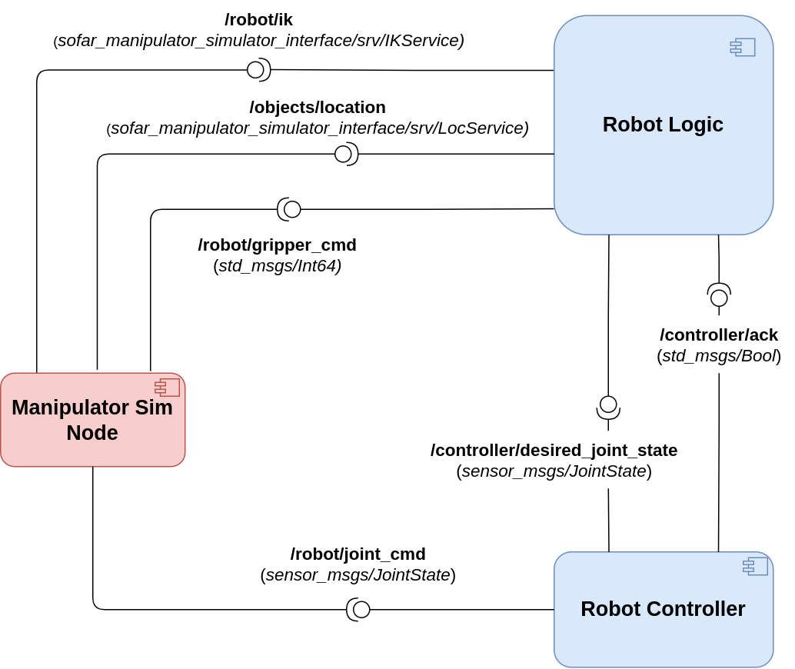

# sofar-manipulator-simulator
Final exam for the SOFAR 2023 course - June Session #2. The goal is to control a simple manipulator robot in order to perform pick and place operations. Implementation is done via ROS2/Python with the help of the Arcade library.

## Dependencies

The project targets ROS2 distributions. It has been successfully tested with Galactic and Humble distros (desktop installation).

The only external depencency needed is Arcade library (see [Instructions for Linux install](https://api.arcade.academy/en/latest/install/linux.html))

## Execution

Clone the repository in your workspace and compile as usual.

Run the simulation node with the command:

```ros2 run sofar_manipulator_simulator manipulator_sim_node```

## Assignment

According to which portion of the exam you need to take, you can focus on specific parts of the assignment:
- If you're taking the full exam, read further, as you will need to implement the full architecture, made up of three nodes.
- If you're taking the pub/sub part only (Part #2), focus on point 2) for the development of the controller.
- If you're taking the client/service part only (Part #3), focus on part 3) for the implementation of the robot logic + you will need to implement the two service interfaces (only the .srv file, the callbacks are already implemented inside *manipulator_sim_node.py*). To this extent, make sure to analyze the commented code in *manipulator_sim_node.py* to correctly define the service interfaces. Of course, feel free to de-comment the code once you have provided the interfaces to test your solution.

1) The **manipulation sim node** is already provided with this repository and acts as the simulator of the manipulator robot, exposing all the necessary interfaces. Specifically, the robot is tasked with collecting the two colored balls and transporting them to their target positions, represented by outlined circles. On every simulation, balls and corresponding targets are randomly spawned in the environment, always ensuring that they lay within the reachable workspace of the robot.
    1. *Subscribed Topic*
       1) **/robot/joint_cmd**: *JointState* message representing the joint configuration to be applied to the robot (resulting from the controller)
       2) **/robot/gripper_cmd**: *Int64* message used to control the robot'gripper to grasp and drop objects. Specifically, set the data field to 1 for grasping and to -1 for dropping.
    2. *Exposed Services*
       1) **/robot/ik**: computes the inverse kinematics given a desired end-effector's 2D pose (namely *x*, *y* and *theta*), returning the corresponding joint angles (if there is a feasible solution), otherwise returning an empty list.
       2) **/objects/location**: allows retrieving the (x,y) coordinates of an item in the environment, querying by category (BALL/TARGET) and color (RED/BLUE). Such coordinates can then be used to compute IK and thus move the robot accordingly.

2) The **controller node**, which controls the individual joints through PIDs to drive them to their desired configuration. **Each joint controller is responsible of maintaining the estimate of the current joint position, which is set to 0 at the beginning of the simulation**. The node receives desired joint configurations (resulting from computation of the IK) from the **logic node** on the **/controller/desired_joint_state** topic and activates the internal joint controllers to move the robot to the desired state. Throughout the control loop, the controller publishes the updated joint positions (resulting from the control law) on the **/robot/joint_cmd** topic, which will move the robot correspondingly. On completion of the control loop, the node signals its idle state as usual.

3) The **robot logic node**, which acts as *high-level controller*, driving the routine to pick and place the colored balls. Specifically, the node will invoke the **/objects/location** service to locate the balls and corresponding targets, then will make use of such coordinates to invoke the **/robot/ik**, to find out the joint configuration needed to reach a given location. Once the robot has moved and reached the ball, the logic node will grasp it publishing a message on the corresponding topic, then will move to the target destination, where the ball will be dropped. Since we're implementing a simplified version, which does not make use of action servers, you may need to add the following code inside you *main* function:

```
logic = RobotLogic()
    
# Spinning thread to make sure callbacks are executed
spin_thread = Thread(target=rclpy.spin, args=(logic,))
spin_thread.start()
```



### Important Notes

**BEWARE: It is mandatory to launch the full simulation using a launch file. SUBMISSIONS NOT INCLUDING A LAUNCH FILE WILL NOT BE EVALUATED!!!**

**SINCE THERE WERE PROBLEMS WITH RENAMING LAST SESSION, THIS TIME IT WON'T BE NECESSARY TO RENAME THE PACKAGES**

**IT IS MANDATORY, HOWEVER, TO INDICATE WHICH PART OF THE EXAM YOU'RE TAKING BY ADDING A TXT FILE INSIDE YOUR SUBMISSION**

Good luck ;)

## Expected Output


